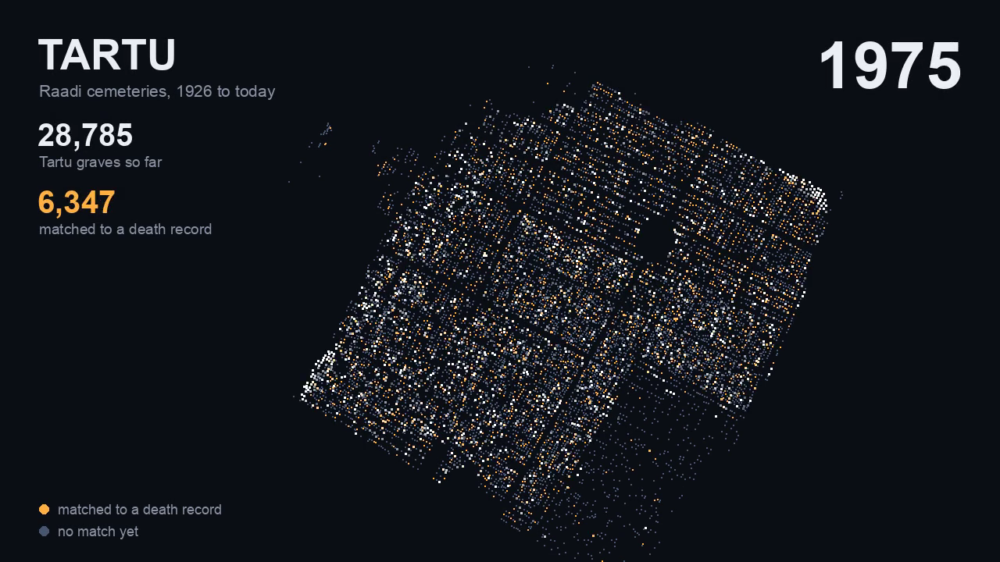

# death-register

Estonia's open death records, joined to where people are buried.

[](docs/showcase.mp4)

*Click for the 50-second video.*


| | |
|---|---|
| Death records (Ministry of the Interior, open data) | 1,732,767 |
| Tartu burials with coordinates (open data) | 84,193 |
| Tartu burials matched to a death record | 49,001 |
| Saaremaa burials (open API), matched to a death record | 27,727 of 50,044 |
| kalmistud.ee burials matched, before it blocked us | 946 of 1,548 fetched |

## What happened

1. **The records came out.** In September 2026 Estonia's Ministry of the Interior
   published every death since 1926 as open data: name, birth date, death date.
   [surmaregister.ee](https://surmaregister.ee/en) lists them. Neither says
   where anyone is buried.
2. **The graves are on kalmistud.ee.** It is the national cemetery portal, run by
   AS Spin TEK for the municipalities of about 234 cemeteries. It only offers a
   name search, 20 rows a page, and its terms forbid scraping.
3. **We tried it anyway and got blocked.** A ten-minute test fetched 1,548
   burials and matched 77% of them to a death record. About 450 requests in, the
   portal refused our address. A full listing needs about 335,000 requests, so
   we stopped.
4. **Tartu publishes its own.** The city's 15 cemeteries are open data behind a
   public API. Nine requests returned all 84,193 burials with coordinates, and
   49,001 matched a death record.
5. **So does Saaremaa.** Same system, same public API: 50,044 burials across 33
   cemeteries, most with full dates and a headstone photo. 27,727 matched.

## Data

| File | Contents |
|---|---|
| `data/tartu/matches.csv` | Name, birth and death dates, burial date, cemetery, plot, coordinates |
| `data/tartu/rows.jsonl` | Every Tartu burial as published |
| `data/saaremaa/` | The same two files for Saaremaa, with headstone photo links |
| `data/haudi/` | The kalmistud.ee proof of concept |

The death records (97 MB) are downloaded, not committed.

## Run

```sh
python3 -I scripts/fetch_register.py
python3 -I scripts/fetch_tartu.py
python3 -I scripts/fetch_saaremaa.py
python3 -I scripts/join_burials.py data/tartu/rows.jsonl
python3 -I scripts/show_matches.py data/tartu/matches.csv --match exact
```

Python 3.9+, no dependencies.

Sources, what was tried and the match rules: [docs/notes.md](docs/notes.md).
